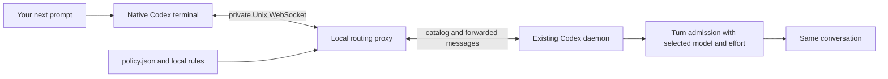

# Codex task router

**Choose a model and reasoning effort for each new prompt, in one native Codex terminal conversation.** The `auto` command opens Codex through a local proxy, reads each new task, and selects from an editable policy before Codex starts that turn.

```text
Plan the cache architecture       → Sol 6.1 · high
List the files in this directory  → Luna · medium
Implement the approved plan       → Sol 6.1 · medium
Run the existing unit tests       → Luna · low
Investigate a deadlock            → Astra · xhigh
Continue                         → retain the last accepted selection
```

These are examples of the shipped rules, subject to your account's available models. Classification is local Python logic; it makes no separate LLM request. The router uses your existing Codex authentication and needs no Python packages or separate API key.

## Watch the demo

https://github.com/user-attachments/assets/82a66c04-8994-4e4b-8a9a-78433368de8e

**[Open the 48-second video](https://github.com/user-attachments/assets/82a66c04-8994-4e4b-8a9a-78433368de8e)** · [Download MP4](https://raw.githubusercontent.com/Shrinidhikulkarni7/codex-task-router/main/videos/router-film/renders/codex-task-router.mp4) · [Offline HTML player](videos/router-film/renders/player.html) · [Subtitles](videos/router-film/renders/codex-task-router.srt)

The illustrated demo shows how new tasks receive model and reasoning-effort choices while keeping one conversation. Play it above or open the video in a new tab. Download the HTML player and open it locally for playback with captions; GitHub's file view does not execute it.

Animation, audio stems, script, rebuild instructions and voice attribution are in the [editable video project](videos/router-film/README.md). See its [verification report](videos/router-film/QA.md) for playback checks and narration limitations.

## Status and compatibility

This is an independent, experimental integration. The user reported that `auto` worked in a real terminal on 2026-10-07 with the Codex 0.160.0 setup. Local CLI inspection subsequently found 0.160.1; that is not a separate runtime verification. Automated tests use simulated clients and servers and make no inference requests.

OpenAI documents the app-server and WebSocket interface as experimental and unsupported for production workloads. This repository adds validation, diagnostics, cleanup, and protocol tests, but cannot turn that upstream interface into a production support guarantee. See [compatibility and verification](docs/compatibility.md). [Official App Server documentation](https://learn.chatgpt.com/docs/app-server#protocol).

## Quick start

You need macOS or Linux, Python 3.11+, Git, and a signed-in Codex CLI that supports `--remote unix://PATH` and `app-server proxy`. The existing local Codex daemon must be running and reachable. Open ordinary Codex once in your terminal if it has not started yet; `auto` does not start or replace it.

```sh
git clone https://github.com/Shrinidhikulkarni7/codex-task-router.git
cd codex-task-router
python3 --version
codex --version
codex login status
python3 install.py --dry-run
python3 install.py
```

The default installer creates a skill symlink. It leaves existing hooks and feature settings alone. Keep this checkout at its installed path.

Set a convenient path, then start the router from the project you want to work on:

```sh
ROUTER_SCRIPT="${CODEX_HOME:-$HOME/.codex}/skills/codex-model-router/scripts/router.py"
python3 "$ROUTER_SCRIPT" doctor
python3 "$ROUTER_SCRIPT" auto
```

`doctor` should report `"control_socket": "reachable"`. Hook readiness and live-switching flags are optional for `auto`. Use `auto --cwd /absolute/path/to/project` to select a different project, or `auto --thread THREAD_ID` to resume a conversation.

Keep entering ordinary prompts in that window. When you send another message while a turn is still working, Codex may treat it as steering; steering retains the active turn's model. A separate Codex app or terminal opened normally does not pass through this proxy.

From another terminal, inspect the most recent choices:

```sh
python3 "$ROUTER_SCRIPT" status
python3 "$ROUTER_SCRIPT" status --thread THREAD_ID
```

For proxy records, `accepted` means Codex acknowledged the selected turn request. It does not independently measure which model performed inference.

## Choose how to route

| Command | Scope | Requirements |
| --- | --- | --- |
| `auto` | Every new text prompt in the terminal it opens | Reachable daemon; native remote TUI; local Unix sockets |
| `preview` | Print a proposed choice without starting a task | Codex's local model cache |
| `run` | Initial task of a new native Codex session | Local model cache for a routed task |
| `apply` | Compatible live change in an already active turn | Reachable hosting daemon; `step_model_switching` |
| `doctor` | Read connection, catalog, and optional hook diagnostics | Reachable daemon |
| `status` | Read local routing history | No daemon required |
| `hook` | Legacy asynchronous `UserPromptSubmit` handler | Explicit installation, hook trust, live-switching support |

Use [the complete usage guide](docs/usage.md) for every command and option, installation, updates, and removal. Use [troubleshooting](docs/troubleshooting.md) for connection, catalog, and live-switching failures.

## Policy and overrides

The profiles in [policy.json](skills/codex-model-router/policy.json) are starting preferences, not measured model rankings or promised savings.

| Profile | Work | Candidate models, in order | Effort |
| --- | --- | --- | --- |
| `precheck` | Run existing checks | `gpt-6-luna`, `gpt-5.6-luna` | `low` |
| `easy` | Small edit, extraction, summary | `gpt-6-luna`, `gpt-5.6-luna` | `medium` |
| `coding` | Implementation | `gpt-6.1-sol`, `gpt-6-sol`, `gpt-5.6-sol` | `medium` |
| `review` | Routine review | Same Sol candidates | `medium` |
| `planning` | Architecture and tradeoffs | Same Sol candidates | `high` |
| `debugging` | Root-cause investigation | Same Sol candidates | `high` |
| `deep-debug` | Difficult failures or explicit escalation | `gpt-6-astra` | `xhigh` |
| `terra` | Straightforward execution by preference | `gpt-5.6-terra` | `medium` |

`auto` validates a choice against the connected server's catalog. It selects the first advertised, non-hidden model in the profile, then checks its effort. It reports an error if either requirement cannot be met; it does not invent an alternative family.

Use an explicit prefix when you want deterministic routing:

```text
[route:planning] Design the worker queue and retry policy.
[route:terra] Implement the approved straightforward changes.
[route:deep-debug] Investigate the intermittent deadlock.
[route:off] Use my native model selection for this prompt.
Use Luna with medium reasoning to list the files.
```

A successful native `/model` update takes priority for the next prompt unless that prompt contains a leading route directive. Ambiguous continuations keep the remembered selection, with a planning-profile fallback in Codex Plan mode. See [selection precedence and customization](docs/usage.md#selection-precedence) for the exact scope.

To prefer Terra for ordinary implementation, change only the `coding` entry in `policy.json`:

```json
"coding": {"models": ["gpt-5.6-terra"], "effort": "medium"}
```

Model availability varies. An explicit Terra profile will fail visibly when Terra is not advertised for your account. Set `"enabled": false` to disable routing globally.

## How it works



The proxy updates `model` and `effort` on eligible `turn/start` requests, including collaboration-mode overrides. It preserves other fields, forwards approvals to the native client, and keeps the conversation's thread ID. Read [architecture and data handling](docs/architecture.md) for state, transport, and failure behavior.

## Optional live hook

The legacy hook can make compatible changes after admission. It is unnecessary for `auto`, may finish after inference has begun, and cannot make every model transition within an active turn.

```sh
python3 install.py --legacy-hook --dry-run
python3 install.py --legacy-hook
codex features enable step_model_switching
```

Start a new Codex session and use `/hooks` to review and trust **Selecting Codex model**. The installer does not trust hooks or change feature flags. Follow [the live-hook guide](docs/usage.md#optional-legacy-hook) for verification and compatibility limits.

## Development

```sh
python3 -m unittest discover -s tests -v
```

Tests cover routing, validation, protocol framing, approvals, lifecycle, and isolated installer behavior. The real Unix-listener smoke test skips when the host explicitly forbids binding; process-pipe protocol tests still run. See [contributing](CONTRIBUTING.md), [security and privacy](SECURITY.md), and [verification limits](docs/compatibility.md).

No license has been selected for this repository.
