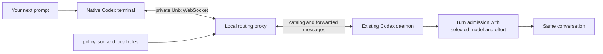

# Codex task router

**Match the model to the work, without switching for every small follow-up.** The `auto` command opens one native Codex terminal conversation through a local proxy. Its default selective mode retains model and effort for brief checks and continuations, and can reselect when a clear instruction calls for a different work phase. Selection happens before the next turn starts.

```text
Plan the cache architecture        → Sol 6.1 · high
Implement the approved plan        → Sol 6.1 · medium
Run the existing unit tests        → keep Sol 6.1 · medium
Investigate the deadlock           → Astra · xhigh
Continue                          → keep Astra · xhigh
New task: List files here          → Luna · medium
```

These are examples of the shipped rules, subject to your account's available models. Default classification is local Python logic with no inference request. The router uses your existing Codex authentication and needs no Python packages or separate API key. An optional local Laya service can supply experimental semantic classification; its dependencies are installed separately.

The rules consider the requested action and stated scope before domain keywords. A one-sentence definition of a deadlock selects `easy`; investigating an actual deadlock selects `deep-debug`. A one-line pure helper selects `easy`, while building a whole compiler selects the higher-reasoning `planning` profile. These remain heuristics. The [evaluation guide](docs/routing-evaluation.md) records 70 authored routing cases, before/after results, and optional checks of actual model answers.

For unfamiliar wording, the [optional Laya integration](skills/codex-model-router/references/laya.md) adds `shadow` comparisons and experimental active classification to `auto`. Rules remain the default. Pins, phase retention, and model validation stay authoritative. Real Laya accuracy and savings have not been established here.

## Watch the demo

https://github.com/user-attachments/assets/82a66c04-8994-4e4b-8a9a-78433368de8e

**[Open the 48-second video](https://github.com/user-attachments/assets/82a66c04-8994-4e4b-8a9a-78433368de8e)** · [Download MP4](https://raw.githubusercontent.com/Shrinidhikulkarni7/codex-task-router/main/videos/router-film/renders/codex-task-router.mp4) · [Offline HTML player](videos/router-film/renders/player.html) · [Subtitles](videos/router-film/renders/codex-task-router.srt)

The illustrated demo shows the original per-prompt behavior, available with `"routing_mode": "prompt"`. The default now switches selectively, as shown above; the video has not been rerecorded for this update. Play it here or open it in a new tab. Download the HTML player and open it locally for playback with captions; GitHub's file view does not execute it.

Animation, audio stems, script, rebuild instructions and voice attribution are in the [editable video project](videos/router-film/README.md). See its [verification report](videos/router-film/QA.md) for playback checks and narration limitations.

## Status and compatibility

This is an independent, experimental integration. The user reported that `auto` worked in a real terminal on 2026-10-07 with the Codex 0.160.0 setup. Local CLI inspection subsequently found 0.160.1; that is not a separate runtime verification. Automated tests use simulated clients and servers and make no inference requests.

Selective routing passes local behavior/protocol tests. The earlier task mode also passed a six-turn user-terminal check, verified against routing records and the local session log. That live check does not validate the newly added phase rules, and cost savings remain unproven. See the [recorded checks](docs/compatibility.md#evidence-as-of-2026-10-08) and [live usage measurements](docs/usage-and-cost.md#live-task-retention-verification-2026-10-08).

OpenAI documents the app-server and WebSocket interface as experimental and unsupported for production workloads. This repository adds validation, diagnostics, cleanup, and protocol tests, but cannot turn that upstream interface into a production support guarantee. See [compatibility and verification](docs/compatibility.md). [Official App Server documentation](https://learn.chatgpt.com/docs/app-server#protocol).

## Quick start

You need macOS or Linux, Python 3.11+, Git, and a signed-in Codex CLI that supports `--remote unix://PATH` and `app-server proxy`. The existing local Codex daemon must be running and reachable. Open ordinary Codex once in your terminal if it has not started yet; `auto` does not start or replace it.

```sh
git clone https://github.com/Shrinidhikulkarni7/codex-task-router.git
cd codex-task-router
python3 --version
codex --version
codex login status
python3 install.py --dry-run
python3 install.py
```

The default installer creates a skill symlink. It leaves existing hooks and feature settings alone. Keep this checkout at its installed path.

Set a convenient path, then start the router from the project you want to work on:

```sh
ROUTER_SCRIPT="${CODEX_HOME:-$HOME/.codex}/skills/codex-model-router/scripts/router.py"
python3 "$ROUTER_SCRIPT" doctor
python3 "$ROUTER_SCRIPT" auto
```

`doctor` should report `"control_socket": "reachable"`. Hook readiness and live-switching flags are optional for `auto`. Use `auto --cwd /absolute/path/to/project` to select a different project, or `auto --thread THREAD_ID` to resume a conversation.

Keep entering prompts in that window. Brief follow-ups retain the selection; recognized work-phase instructions can reselect. Begin an unrelated task with `New task: ...` or `[route:new] ...`. Explicit model/profile/effort choices stay pinned until a boundary or another override. Resuming a conversation pins the settings reported by Codex because earlier manual-choice provenance is unavailable. Active-turn steering keeps the active model. A separate Codex app or terminal opened normally does not pass through this proxy.

Codex also creates temporary threads for work such as conversation titles. Threads identified as ephemeral keep Codex's native model settings and appear as `skipped` with `thread_kind: "ephemeral"` in routing history. Their reported usage stays separate from your task's thread.

From another terminal, inspect the most recent choices:

```sh
python3 "$ROUTER_SCRIPT" status
python3 "$ROUTER_SCRIPT" status --thread THREAD_ID
```

For proxy records, `accepted` means Codex acknowledged the selected turn request. When the daemon reports usage, `token_usage` also contains its latest token and cache counters. These are thread snapshots, not per-model billing or proof of which model performed inference. See [tokens, cache reuse, and comparison instructions](docs/usage-and-cost.md).

## Tokens and cache reuse

Model changes can reduce prompt-cache reuse even between turns. A cheaper model can still cost less despite a cache miss; a more capable model may avoid retries. Selective routing balances those considerations with simple rules, without predicting prices or measuring answer quality. It does not guarantee cache hits or savings. This remains one conversation, with no automatic worker creation. Read the [measurements and cost example](docs/usage-and-cost.md) and [exact decision process](docs/selective-routing.md).

## Choose how to route

| Command | Scope | Requirements |
| --- | --- | --- |
| `auto` | Selective switching; optional fixed-task or per-prompt modes | Reachable daemon; native remote TUI; local Unix sockets |
| `preview` | Print a proposed choice without starting a task | Codex's local model cache |
| `run` | Initial task of a new native Codex session | Local model cache for a routed task |
| `apply` | Compatible live change in an already active turn | Reachable hosting daemon; `step_model_switching` |
| `doctor` | Read connection, catalog, and optional hook diagnostics | Reachable daemon |
| `status` | Read local routing history | No daemon required |
| `hook` | Legacy asynchronous `UserPromptSubmit` handler | `prompt` mode, explicit installation, hook trust, live-switching support |

Use [the complete usage guide](docs/usage.md) for every command and option, installation, updates, and removal. Use [troubleshooting](docs/troubleshooting.md) for connection, catalog, and live-switching failures.

## Policy and overrides

The profiles in [policy.json](skills/codex-model-router/policy.json) are starting preferences, not measured model rankings or promised savings.

| Profile | Work | Candidate models, in order | Effort |
| --- | --- | --- | --- |
| `precheck` | Run existing checks | `gpt-6-luna`, `gpt-5.6-luna` | `low` |
| `easy` | Small edit, extraction, summary | `gpt-6-luna`, `gpt-5.6-luna` | `medium` |
| `coding` | Implementation | `gpt-6.1-sol`, `gpt-6-sol`, `gpt-5.6-sol` | `medium` |
| `review` | Routine review | Same Sol candidates | `medium` |
| `planning` | Architecture and tradeoffs | Same Sol candidates | `high` |
| `debugging` | Root-cause investigation | Same Sol candidates | `high` |
| `deep-debug` | Difficult failures or explicit escalation | `gpt-6-astra` | `xhigh` |
| `terra` | Straightforward execution by preference | `gpt-5.6-terra` | `medium` |

`auto` validates a choice against the connected server's catalog. It selects the first advertised, non-hidden model in the profile, then checks its effort. It reports an error if either requirement cannot be met; it does not invent an alternative family.

Use an explicit prefix when you want deterministic routing:

```text
New task: Design the worker queue and retry policy.
[route:new] List the files in this directory.
[route:planning] Design the worker queue and retry policy.
[route:terra] Implement the approved straightforward changes.
[route:deep-debug] Investigate the intermittent deadlock.
[route:off] Use my native model selection for this prompt.
Use Luna with medium reasoning to list the files.
```

A successful native `/model` update observed through the proxy pins the choice, as does an accepted explicit profile/model/effort request. `New task:` allows automatic selection again while keeping the same conversation and history. The router does not infer task completion or count tool failures. It recognizes specific user reports of repeated unsuccessful fixes. See [selection precedence](docs/usage.md#selection-precedence) and [the rules and their limits](docs/selective-routing.md).

The shipped top-level policy is `"routing_mode": "selective"`; policies without this field use the same default. Existing policies explicitly set to `"task"` or `"prompt"` keep that behavior. Choose `task` to retain settings until a boundary/override, or `prompt` to classify each eligible prompt. Restart `auto` after updating Python source; the installed skill links directly to this checkout.

To prefer Terra for ordinary implementation, change only the `coding` entry in `policy.json`:

```json
"coding": {"models": ["gpt-5.6-terra"], "effort": "medium"}
```

Model availability varies. An explicit Terra profile will fail visibly when Terra is not advertised for your account. Set `"enabled": false` to disable routing globally.

## How it works



The proxy updates `model` and `effort` on eligible `turn/start` requests, including collaboration-mode overrides. It preserves other fields, forwards approvals to the native client, and keeps the conversation's thread ID. Read [architecture and data handling](docs/architecture.md) for state, transport, and failure behavior.

## Optional live hook

The legacy hook only changes settings with `"routing_mode": "prompt"`. In selective and task modes it records a skip. It is unnecessary for `auto`, may finish after inference has begun, and cannot make every model transition within an active turn. To use it deliberately, set prompt mode first:

```sh
python3 install.py --legacy-hook --dry-run
python3 install.py --legacy-hook
codex features enable step_model_switching
```

Start a new Codex session and use `/hooks` to review and trust **Selecting Codex model**. The installer does not trust hooks or change feature flags. Follow [the live-hook guide](docs/usage.md#optional-legacy-hook) for verification and compatibility limits.

## Development

```sh
python3 -m unittest discover -s tests -v
```

Tests cover routing, validation, protocol framing, approvals, lifecycle, and isolated installer behavior. The real Unix-listener smoke test skips when the host explicitly forbids binding; process-pipe protocol tests still run. See [contributing](CONTRIBUTING.md), [security and privacy](SECURITY.md), and [verification limits](docs/compatibility.md).

Run the routing rubric with `python3 evals/evaluate.py`. `python3 evals/task_quality.py` lists the optional answer checks without inference. Real answer checks require `--run` and consume normal Codex usage; see [evaluation commands and limits](docs/routing-evaluation.md).

No license has been selected for this repository.
