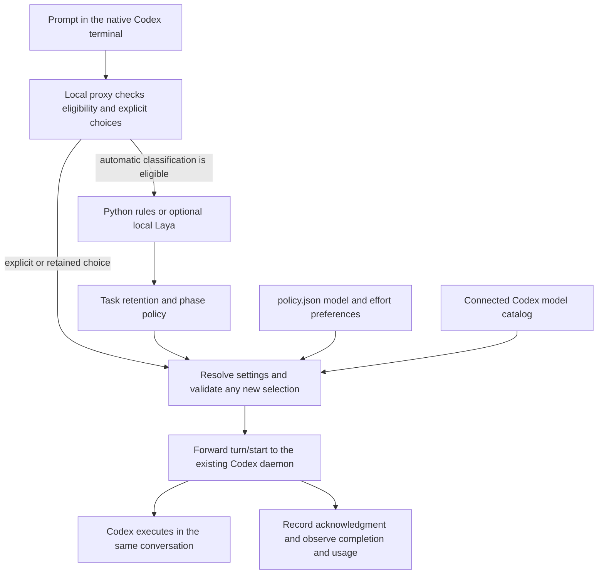

# Codex task router

**Match the Codex model and reasoning effort to the work, while keeping related follow-ups together.** The `auto` command opens one native Codex terminal conversation through a local proxy. Its default selective mode retains settings for brief checks and continuations, and can reselect when a clear instruction calls for a different work phase. Selection happens before the next turn starts.

Use the built-in Python rules, or add a local Laya service to evaluate semantic task classification. The router handles the Codex connection, model preferences, retention, manual overrides, and selection diagnostics in either case.

```text
Plan the cache architecture        → Sol 6.1 · high
Implement the approved plan        → Sol 6.1 · medium
Run the existing unit tests        → keep Sol 6.1 · medium
Investigate the deadlock           → Astra · xhigh
Continue                          → keep Astra · xhigh
New task: List files here          → Luna · medium
```

These are examples of the shipped rules, subject to your account's available models. Default classification is local Python logic with no inference request. The router uses your existing Codex authentication and needs no Python packages or separate API key. An optional local Laya service can supply experimental semantic classification; its dependencies are installed separately.

The rules consider the requested action and stated scope before domain keywords. A one-sentence definition of a deadlock selects `easy`; investigating an actual deadlock selects `deep-debug`. A one-line pure helper selects `easy`, while building a whole compiler selects the higher-reasoning `planning` profile. These remain heuristics. The [evaluation guide](docs/routing-evaluation.md) records 70 authored routing cases, before/after results, and optional checks of actual model answers.

## Why use this with Laya?

[Laya](https://github.com/NandhaKishorM/laya) can interpret a request and return a typed decision. In this integration, that decision is a work profile such as `coding`, `planning`, or `retain`. This repository connects that recommendation to your Codex workflow:

| Responsibility | What handles it |
| --- | --- |
| Interpret the requested work | Built-in Python rules, or optional local Laya classification |
| Decide whether settings may change | The router's task boundaries, phase rules, and explicit-choice pins |
| Map a profile to a model and reasoning effort | Your editable `policy.json`, checked against Codex's available catalog |
| Apply the selection | The local proxy, before Codex admits the next turn in the same conversation |
| Execute the task and request approvals | Codex, using its normal tools, permissions, and authentication |
| Explain the selection and expose reported usage | Local routing history, `status`, and connection diagnostics |

This is useful when you want automatic selection inside the native Codex terminal with those controls already connected. Laya is an optional decision backend; the project works without it. Adding Laya does not establish better routing or lower cost, and this repository makes no accuracy or savings claim over Laya or other routers.

Laya can propose a profile, but cannot invent model IDs or bypass catalog validation. In the default selective routing mode, it cannot override a pinned choice; an unusable response retains an ongoing task's settings, while a new task falls back to the Python rules. The [Laya guide](skills/codex-model-router/references/laya.md) covers setup, data handling, timeouts, comparison reports, and these limits.

## Watch the demo

https://github.com/user-attachments/assets/82a66c04-8994-4e4b-8a9a-78433368de8e

**[Open the 48-second video](https://github.com/user-attachments/assets/82a66c04-8994-4e4b-8a9a-78433368de8e)** · [Download MP4](https://raw.githubusercontent.com/Shrinidhikulkarni7/codex-task-router/main/videos/router-film/renders/codex-task-router.mp4) · [Offline HTML player](videos/router-film/renders/player.html) · [Subtitles](videos/router-film/renders/codex-task-router.srt)

The illustrated demo shows the original per-prompt behavior, available with `"routing_mode": "prompt"`. The default now switches selectively, as shown above; the video has not been rerecorded for this update. Play it here or open it in a new tab. Download the HTML player and open it locally for playback with captions; GitHub's file view does not execute it.

Animation, audio stems, script, rebuild instructions and voice attribution are in the [editable video project](videos/router-film/README.md). See its [verification report](videos/router-film/QA.md) for playback checks and narration limitations.

## Status and compatibility

**Release status: experimental.** Validation, manual-choice protection, bounded requests, failure handling, private diagnostics, and cleanup are implemented. These safeguards have automated coverage; they do not establish a production support guarantee.

Evidence for the Laya integration as of 2026-10-09:

- **196 automated tests:** locally, 194 passed and two socket tests skipped because the sandbox denied binding. All four [CI jobs for the original Laya implementation](https://github.com/Shrinidhikulkarni7/codex-task-router/actions/runs/37950317626) passed on macOS/Linux with Python 3.11/3.13. CI uses fixtures and makes no model inference requests.
- **70/70 authored rule cases matched.** These cases were used during development, so the result is not a measure of accuracy on unseen tasks.
- **Real Codex use was checked separately.** A six-turn user-terminal check verified task retention, explicit selection, completion, and usage records. It does not validate every selective phase or the Laya path. The inspected CLI was 0.160.1; compatibility with future versions is not assumed.
- **A first real Laya comparison completed.** The user ran 24 stress cases through the local service: 22 responses passed adapter checks and two cases skipped inference. All recommendations fell below the provisional 0.8 threshold. [Saved results and offline threshold replay](docs/laya-evaluation.md) explain why active classification is not yet recommended. General routing accuracy, completed-task quality, and cost improvements remain unproven.

OpenAI documents the app-server and WebSocket interface as experimental and unsupported for production workloads. Validate the intended Codex version and representative tasks before relying on this integration. Start Laya in shadow mode and inspect its recommendations before enabling active classification. See [compatibility and verification](docs/compatibility.md), [live usage measurements](docs/usage-and-cost.md#live-task-retention-verification-2026-10-08), and the [official App Server documentation](https://learn.chatgpt.com/docs/app-server#protocol).

## Quick start

You need macOS or Linux, Python 3.11+, Git, and a signed-in Codex CLI that supports `--remote unix://PATH` and `app-server proxy`. The existing local Codex daemon must be running and reachable. Open ordinary Codex once in your terminal if it has not started yet; `auto` does not start or replace it.

```sh
git clone https://github.com/Shrinidhikulkarni7/codex-task-router.git
cd codex-task-router
python3 --version
codex --version
codex login status
python3 install.py --dry-run
python3 install.py
```

The default installer creates a skill symlink. It leaves existing hooks and feature settings alone. Keep this checkout at its installed path.

Set a convenient path, then start the router from the project you want to work on:

```sh
ROUTER_SCRIPT="${CODEX_HOME:-$HOME/.codex}/skills/codex-model-router/scripts/router.py"
python3 "$ROUTER_SCRIPT" doctor
python3 "$ROUTER_SCRIPT" auto
```

`doctor` should report `"control_socket": "reachable"`. Hook readiness and live-switching flags are optional for `auto`. Use `auto --cwd /absolute/path/to/project` to select a different project, or `auto --thread THREAD_ID` to resume a conversation.

Keep entering prompts in that window. Brief follow-ups retain the selection; recognized work-phase instructions can reselect. Begin an unrelated task with `New task: ...` or `[route:new] ...`. Explicit model/profile/effort choices stay pinned until a boundary or another override. Resuming a conversation pins the settings reported by Codex because earlier manual-choice provenance is unavailable. Active-turn steering keeps the active model. A separate Codex app or terminal opened normally does not pass through this proxy.

Codex also creates temporary threads for work such as conversation titles. Threads identified as ephemeral keep Codex's native model settings and appear as `skipped` with `thread_kind: "ephemeral"` in routing history. Their reported usage stays separate from your task's thread.

From another terminal, inspect the most recent choices:

```sh
python3 "$ROUTER_SCRIPT" status
python3 "$ROUTER_SCRIPT" status --thread THREAD_ID
```

For proxy records, `accepted` means Codex acknowledged the selected turn request. When the daemon reports usage, `token_usage` also contains its latest token and cache counters. These are thread snapshots, not per-model billing or proof of which model performed inference. See [tokens, cache reuse, and comparison instructions](docs/usage-and-cost.md).

## Add Laya optionally

The default installation is ready to use with Python rules. To try Laya, follow the [complete local-service setup and comparison guide](skills/codex-model-router/references/laya.md). It includes the pinned service dependency, checkpoint settings, evaluation commands, policy configuration, and rollback to rules.

Only `auto` uses the top-level `classifier` setting in `policy.json`:

| `classifier.mode` | Effect |
| --- | --- |
| `rules` | Default. Local Python classification with no classifier inference request |
| `shadow` | Ask local Laya for a recommendation and record agreement; Python rules still control selection |
| `laya` | Experimental active mode. A validated Laya recommendation supplies the profile candidate, subject to the same retention and model checks |

`shadow` waits for the local service, so it adds latency. The default request deadline is two seconds. Requests contain the current prompt, previous profile, and a follow-up flag; the adapter does not send the full conversation or read project files. The endpoint is restricted to literal loopback addresses. Laya needs its own dependencies, downloaded model weights, and local compute; its classification does not consume Codex inference tokens.

`classifier.mode` answers **how to interpret a task**. The separate `routing_mode` setting answers **when to reconsider the selection**. Explicit requests take priority over either classifier. Selective/task modes preserve their retention behavior; opt-in prompt mode reclassifies ordinary prompts and uses rule fallback on an unusable Laya response. `preview`, `run`, `apply`, and the legacy hook continue to use Python rules.

The 24-case Laya comparison tool lists its cases without contacting a service:

```sh
python3 evals/laya_compare.py
```

After starting the local service, use the guide's explicit `--run` commands to obtain comparison reports. The reports distinguish usable Laya recommendations from retention and fallback results. Set `classifier.mode` back to `rules` to stop Laya calls; use a new-task boundary or explicit choice if you also want to change an ongoing task's selection.

Already have a report? `python3 evals/laya_replay.py PATH_TO_REPORT.json` compares thresholds offline without more inference or policy changes. The [first local evaluation](docs/laya-evaluation.md) includes the saved evidence and explains why a lower threshold should not be adopted from this small stress set alone.

## Tokens and cache reuse

Model changes can reduce prompt-cache reuse even between turns. A cheaper model can still cost less despite a cache miss; a more capable model may avoid retries. Selective routing balances those considerations with simple rules, without predicting prices or measuring answer quality. It does not guarantee cache hits or savings. This remains one conversation, with no automatic worker creation. Read the [measurements and cost example](docs/usage-and-cost.md) and [exact decision process](docs/selective-routing.md).

## Choose how to route

| Command | Scope | Requirements |
| --- | --- | --- |
| `auto` | Selective switching; optional fixed-task or per-prompt modes | Reachable daemon; native remote TUI; local Unix sockets |
| `preview` | Print a proposed choice without starting a task | Codex's local model cache |
| `run` | Initial task of a new native Codex session | Local model cache for a routed task |
| `apply` | Compatible live change in an already active turn | Reachable hosting daemon; `step_model_switching` |
| `doctor` | Read connection, catalog, and optional hook diagnostics | Reachable daemon |
| `status` | Read local routing history | No daemon required |
| `hook` | Legacy asynchronous `UserPromptSubmit` handler | `prompt` mode, explicit installation, hook trust, live-switching support |

Use [the complete usage guide](docs/usage.md) for every command and option, installation, updates, and removal. Use [troubleshooting](docs/troubleshooting.md) for connection, catalog, and live-switching failures.

## Policy and overrides

The profiles in [policy.json](skills/codex-model-router/policy.json) are starting preferences, not measured model rankings or promised savings.

| Profile | Work | Candidate models, in order | Effort |
| --- | --- | --- | --- |
| `precheck` | Run existing checks | `gpt-6-luna`, `gpt-5.6-luna` | `low` |
| `easy` | Small edit, extraction, summary | `gpt-6-luna`, `gpt-5.6-luna` | `medium` |
| `coding` | Implementation | `gpt-6.1-sol`, `gpt-6-sol`, `gpt-5.6-sol` | `medium` |
| `review` | Routine review | Same Sol candidates | `medium` |
| `planning` | Architecture and tradeoffs | Same Sol candidates | `high` |
| `debugging` | Root-cause investigation | Same Sol candidates | `high` |
| `deep-debug` | Difficult failures or explicit escalation | `gpt-6-astra` | `xhigh` |
| `terra` | Straightforward execution by preference | `gpt-5.6-terra` | `medium` |

`auto` validates a choice against the connected server's catalog. It selects the first advertised, non-hidden model in the profile, then checks its effort. It reports an error if either requirement cannot be met; it does not invent an alternative family.

Use an explicit prefix when you want deterministic routing:

```text
New task: Design the worker queue and retry policy.
[route:new] List the files in this directory.
[route:planning] Design the worker queue and retry policy.
[route:terra] Implement the approved straightforward changes.
[route:deep-debug] Investigate the intermittent deadlock.
[route:off] Use my native model selection for this prompt.
Use Luna with medium reasoning to list the files.
```

A successful native `/model` update observed through the proxy pins the choice in selective/task modes, as does an accepted explicit profile/model/effort request. `New task:` allows automatic selection again while keeping the same conversation and history. Opt-in prompt mode instead reclassifies ordinary prompts; a native model update protects the next accepted ordinary prompt. The router does not infer task completion or count tool failures. It recognizes specific user reports of repeated unsuccessful fixes. See [selection precedence](docs/usage.md#selection-precedence) and [the rules and their limits](docs/selective-routing.md).

The shipped top-level policy is `"routing_mode": "selective"`; policies without this field use the same default. Existing policies explicitly set to `"task"` or `"prompt"` keep that behavior. Choose `task` to retain settings until a boundary/override, or `prompt` to classify each eligible prompt. Restart `auto` after updating Python source; the installed skill links directly to this checkout.

To prefer Terra for ordinary implementation, change only the `coding` entry in `policy.json`:

```json
"coding": {"models": ["gpt-5.6-terra"], "effort": "medium"}
```

Model availability varies. An explicit Terra profile will fail visibly when Terra is not advertised for your account. Set `"enabled": false` to disable routing globally.

## How it works

The default selective session follows this path:



1. **Open the routed session.** `auto` checks the existing daemon, creates a private Unix socket, and launches the native Codex terminal through it. Only traffic through that session is routed.
2. **Check the incoming turn.** The proxy reads policy and examines eligible text prompts. Active-turn steering, tool-output turns, and identified ephemeral threads keep Codex's settings. Explicit and pinned choices take precedence over automatic classification.
3. **Propose a work profile.** Python rules inspect the action and scope. With Laya enabled, eligible prompts also go to the local classifier: shadow mode records the comparison; active mode may use a validated recommendation. Unrecognized rule input can retain the native/current choice.
4. **Apply retention and resolve settings.** The routing mode decides whether a candidate can change the current selection. When a new selection is needed, the router maps the profile to configured model/effort preferences and checks the live catalog. An unavailable required model or effort produces a visible error before submission.
5. **Submit the turn.** The proxy updates model/effort fields, including collaboration-mode overrides, while preserving prompt content, conversation ID, permissions, and other fields. Codex remains responsible for admission, execution, and approvals.
6. **Record the result.** Selection state is committed only after a valid turn acknowledgment. Completion and token/cache notifications update local history when available. `status` shows those records; a rejected or unacknowledged turn is not reported as an accepted selection.

Read [architecture and data handling](docs/architecture.md) for transport, state, privacy, shutdown, and failure details, or [the selective decision process](docs/selective-routing.md) for exactly which follow-ups may switch.

## Optional live hook

The legacy hook only changes settings with `"routing_mode": "prompt"`. In selective and task modes it records a skip. It is unnecessary for `auto`, may finish after inference has begun, and cannot make every model transition within an active turn. To use it deliberately, set prompt mode first:

```sh
python3 install.py --legacy-hook --dry-run
python3 install.py --legacy-hook
codex features enable step_model_switching
```

Start a new Codex session and use `/hooks` to review and trust **Selecting Codex model**. The installer does not trust hooks or change feature flags. Follow [the live-hook guide](docs/usage.md#optional-legacy-hook) for verification and compatibility limits.

## Development

```sh
python3 -m unittest discover -s tests -v
```

Tests cover routing, validation, protocol framing, approvals, lifecycle, isolated installer behavior, and the Laya adapter. Real Unix-listener and loopback HTTP tests skip when the host explicitly forbids binding; process-pipe protocol tests and buffered HTTP fixtures still run. See [contributing](CONTRIBUTING.md), [security and privacy](SECURITY.md), and [verification limits](docs/compatibility.md).

Run the routing rubric with `python3 evals/evaluate.py`. `python3 evals/task_quality.py` lists the optional answer checks without inference. Real answer checks require `--run` and consume normal Codex usage; see [evaluation commands and limits](docs/routing-evaluation.md).

No license has been selected for this repository.
