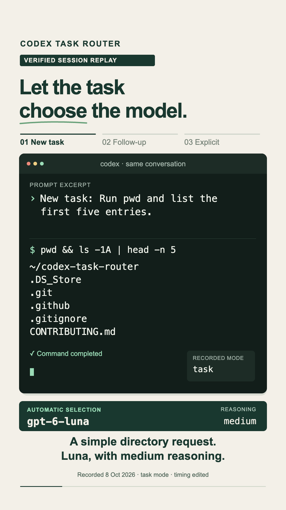
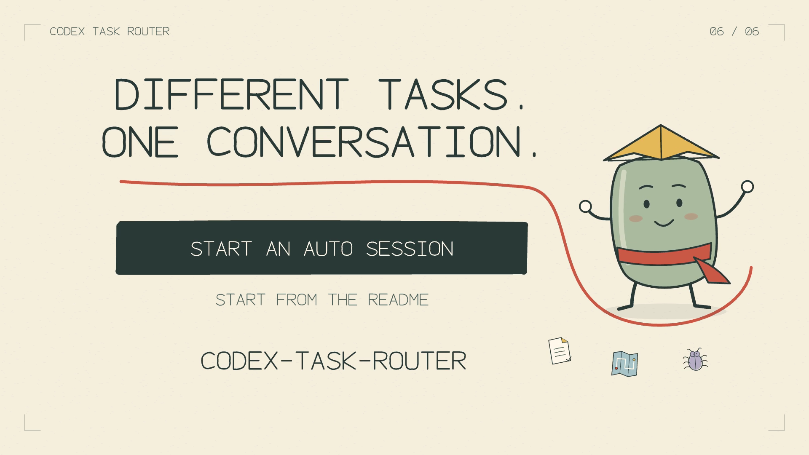

# Codex Task Router

[](https://github.com/Shrinidhikulkarni7/codex-task-router/actions/workflows/ci.yml)
[](LICENSE)
[](docs/compatibility.md)

**Choose a Codex model and reasoning effort for the work at hand, while keeping related follow-ups together.**

Codex Task Router runs your native Codex terminal through a local proxy. It selects settings before a turn starts, retains them for brief follow-ups, and lets explicit choices take priority. Your conversation, tools, authentication, and approvals stay with Codex.

```text
Plan the cache architecture        → Sol · high
Implement the approved plan        → Sol · medium
Run the existing unit tests        → retain Sol · medium
Investigate the deadlock           → Astra · xhigh
Continue                          → retain Astra · xhigh
New task: List files here          → Luna · medium
```

Examples use the shipped rules and depend on your available models. Preferences are configurable. This is an **experimental community integration** with Codex's app-server; see [compatibility](docs/compatibility.md) before adopting it.

## Quick start

Requires **macOS or Linux, Python 3.11+, Git, and a signed-in compatible Codex CLI**. The default router uses only Python's standard library. No extra API key or classifier model is needed.

```sh
git clone https://github.com/Shrinidhikulkarni7/codex-task-router.git
cd codex-task-router
python3 install.py --dry-run
python3 install.py
```

The installer links the skill to this checkout. Keep the checkout in place. Open ordinary Codex once to start its local daemon if needed, then run:

```sh
ROUTER_SCRIPT="${CODEX_HOME:-$HOME/.codex}/skills/codex-model-router/scripts/router.py"
python3 "$ROUTER_SCRIPT" doctor
python3 "$ROUTER_SCRIPT" auto --cwd /absolute/path/to/your/project
```

Replace the project path. `doctor` should report `"control_socket": "reachable"`. Only the terminal opened through `auto` is routed. A hook is not required.

Submit each prompt after the previous response finishes. Use `New task: ...` to allow a fresh choice within the same conversation, or `[route:coding] ...` to pin a profile. Inspect recent choices from another terminal:

```sh
python3 "$ROUTER_SCRIPT" status
```

[Complete installation, resume, update, and uninstall instructions →](docs/usage.md)

## What it adds

- **Task continuity:** brief checks and continuations keep their settings; recognized work phases can reselect.
- **Manual control:** explicit profiles, model requests, and observed native `/model` choices take priority.
- **Configurable preferences:** map each profile to available models and reasoning effort.
- **Visible decisions:** inspect selection reasons, acknowledgments, completion, and reported usage locally.
- **Optional semantic classification:** compare a local Laya service in shadow mode before considering active routing.

The default classifier recognizes actions and scope with Python rules. Unrecognized wording can keep the current choice. It does not understand every task, infer completion, or optimize prices. Model switching can affect cache reuse; **lower cost and better task quality are not established**. See [measurements and limitations](docs/usage-and-cost.md).

## Where Laya fits

[Laya](https://github.com/NandhaKishorM/laya) can interpret a request and return a typed decision. This repository connects that decision to a Codex session:

| Layer | Responsibility |
| --- | --- |
| Python rules or optional Laya | Propose a work profile |
| Router policy | Respect pins, retain follow-ups, decide when to reconsider |
| Model preferences and live catalog | Resolve an available model and supported effort |
| Local session proxy | Apply settings before the turn starts; forward native approvals |
| Codex | Execute the task in the same conversation |

Use this project for that integration and control. Use Laya as an optional classifier inside it. The router works without Laya and makes no accuracy advantage claim over it. The [recorded Laya evaluation](docs/laya-evaluation.md) does not yet justify active mode by default.

[Set up local Laya and shadow comparisons →](skills/codex-model-router/references/laya.md)

## Make it yours

Create `skills/codex-model-router/policy.local.json` for personal settings; leave the shipped policy unchanged. Merge into an existing local file if you already have one.

```json
{
  "routing_mode": "task",
  "profiles": {
    "coding": {"models": ["gpt-5.6-terra"], "effort": "medium"}
  }
}
```

This example retains ordinary follow-ups and prefers Terra for implementation, when your catalog offers it. The default is selective routing with Sol for coding. Run `python3 "$ROUTER_SCRIPT" config` to inspect merged settings without contacting a service. Local overrides are ignored by Git and excluded from the skill archive.

[Profiles, modes, precedence, and configuration →](skills/codex-model-router/references/configuration.md)

## Demo

### Captioned terminal replay

Automatic Luna selection, a retained follow-up, and an explicit Sol override in one conversation. **35 seconds · portrait 1080p · captions · silent.**

<a href="https://raw.githubusercontent.com/Shrinidhikulkarni7/codex-task-router/main/videos/terminal-demo/renders/codex-task-router-terminal.mp4">
  
</a>

[Open MP4](https://raw.githubusercontent.com/Shrinidhikulkarni7/codex-task-router/main/videos/terminal-demo/renders/codex-task-router-terminal.mp4) · [Subtitles](videos/terminal-demo/renders/terminal-demo.srt) · [Editable sources, offline player, and verification](videos/terminal-demo/README.md)

This is a replay reconstructed from verified terminal records in **task mode**, with prompt excerpts, anonymized paths, and edited timing. The model readout is an editorial overlay of recorded settings. The current default is selective routing, described above.

<details>
<summary>Earlier illustrated explainer (48 seconds)</summary>

[](https://github.com/user-attachments/assets/82a66c04-8994-4e4b-8a9a-78433368de8e)

[Watch the 48-second video](https://github.com/user-attachments/assets/82a66c04-8994-4e4b-8a9a-78433368de8e) · [Download MP4](https://raw.githubusercontent.com/Shrinidhikulkarni7/codex-task-router/main/videos/router-film/renders/codex-task-router.mp4) · [Editable sources and offline player](videos/router-film/README.md)

The animation illustrates optional per-prompt routing. The current default is selective routing, described above. Voice attribution and playback limits are in the [media credits](videos/router-film/SOURCES.md) and [QA report](videos/router-film/QA.md).

</details>

## Documentation and development

[Documentation index](docs/README.md) · [Troubleshooting](docs/troubleshooting.md) · [Architecture](docs/architecture.md) · [Security](SECURITY.md) · [Contributing](CONTRIBUTING.md)

```sh
python3 scripts/check.py        # Offline checks; no credentials or inference
python3 scripts/build_skill.py  # Self-contained skill ZIP and checksum in dist/
```

The installable skill is in `skills/codex-model-router/`; repository tests, evaluations, and demo sources stay outside it. See [distribution instructions](docs/distribution.md) for archive installation and release checks.

Licensed under [MIT](LICENSE). Third-party tools and media technology retain their own terms; see [notices](NOTICE.md).
