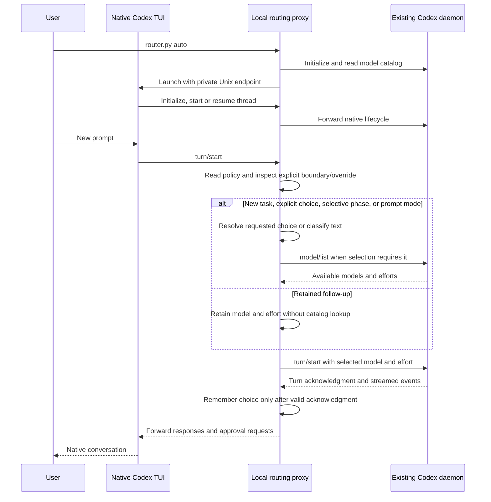

# Architecture and data handling

The router has three integration paths. `auto` selects settings before turn admission; default selective mode retains brief follow-ups and can reselect on recognized phase instructions. Optional task mode retains until a boundary/override; prompt mode reclassifies each prompt. `run` selects startup settings for one new session. The optional hook and `apply` use a live-update method after a turn has already started. The entry point is [router.py](../skills/codex-model-router/scripts/router.py); the automatic bridge is [session_proxy.py](../skills/codex-model-router/scripts/session_proxy.py).

## Configuration

The installed skill's `policy.json` supplies shared defaults. An optional `policy.local.json` merges personal fields before validation; it is ignored by Git and excluded from archives. Objects merge recursively and arrays replace inherited values. `config` shows effective settings without a service connection. See [the configuration contract](../skills/codex-model-router/references/configuration.md).

## Automatic session

Startup checks the existing daemon before opening the TUI. A temporary directory under `/tmp` holds an owner-only `session.sock`; the directory has mode `0700` and the socket `0600`. The child command is conceptually `codex --remote unix://PATH --cd PROJECT`, optionally followed by `resume THREAD_ID` and an initial prompt. There is no public TCP listener.

The bridge opens `codex app-server proxy` to the upstream control socket. That command copies bytes. The router implements the required HTTP upgrade and WebSocket framing on the native-client and daemon sides; JSON lines are appropriate for a directly launched stdio app-server, not this Unix WebSocket endpoint. [Official transport documentation](https://learn.chatgpt.com/docs/app-server#protocol).

Eligible requests are text-bearing `turn/start` calls with a thread ID, no tool-output payload, and no observed active turn on that thread. `turn/steer`, tool calls, tool-output turns, and requests that become active during catalog lookup keep their existing selection. Nontext items in mixed input are forwarded but do not participate in classification.

Threads identified as `ephemeral` in lifecycle responses, start/fork request metadata, or `thread/started` notifications are excluded from classification. The native TUI uses temporary threads for auxiliary tasks such as title generation; their instructions must not override Codex's native model choice. The proxy forwards their turns unchanged, without policy or catalog lookups, and records `skipped` with `thread_kind: "ephemeral"`. Usage remains associated with that separate thread. Closing a thread releases its routing state; partial metadata does not erase a known ephemeral classification.

The selected values replace top-level `model` and `effort`. If `collaborationMode` exists, its `settings.model` and `settings.reasoning_effort` are also updated because they override top-level settings in the inspected protocol. Mode instructions, prompt contents, thread IDs, working directory, sandbox settings, permissions, approvals, and unrelated fields remain intact. Requests and responses are reserialized as JSON; forwarding preserves their meaning rather than their original byte layout.

Default routing uses deterministic local rules and the editable policy, with no classifier inference call. The rules identify affirmative actions and scope, preserve quoted spans while separating steps, and choose the strongest recognized signal in a mixed request. Optional [Laya modes](../skills/codex-model-router/references/laya.md) call a local HTTP service for a candidate profile: shadow mode records it, active mode may use it. The selective retention layer then decides whether to reuse settings. Both paths are evaluated separately from model answer quality. A catalog lookup supplies available model IDs and supported reasoning efforts; the router's own RPC request IDs are isolated from native request IDs. See [evaluation design](routing-evaluation.md).

Retention is in-memory state per thread: model/effort, selected phase, and whether the choice is pinned. A newly started thread permits initial classification. A valid `turn/start` acknowledgment commits its requested selection and decision metadata, including a pinned native choice forwarded while routing was disabled. Preparing, rejecting, or receiving an acknowledgment without a valid turn ID does not commit a new state. Turn completion leaves state intact. `thread/resume` and `thread/fork` seed and pin Codex's reported settings because past manual-choice provenance is unavailable. Closing a thread releases its state. There is no persisted task-body store or separate worker thread.

Leading `New task:` and `[route:new]` markers allow fresh automatic selection. Explicit model/effort requests, profile directives, and successful native model-settings updates replace and pin the choice. For unpinned selective-mode follow-ups, affirmative work instructions can escalate profiles; approved-plan implementation and substantial summary/extraction batches permit specific downward transitions. This is a profile heuristic, not cost or quality prediction. The proxy does not infer task completion or count tool failures; repeated-failure wording is a user report. It cannot observe model changes over unrelated connections. Prompt mode skips retention and gives native settings updates priority for one accepted ordinary prompt. See [the full decision process](selective-routing.md) and [precedence](usage.md#selection-precedence).

## Failure and lifecycle behavior

A catalog, policy, or selection error is returned to the native client before the affected task is forwarded. The router does not begin that task with an unrequested substitute. A rejected `turn/start` is recorded as failed; a disconnected request without acknowledgment is unconfirmed. A successful acknowledgment records the turn ID, and completion notifications add `turn_status`.

The bridge forwards daemon approval requests to the native TUI and the user's responses back. It does not decide approvals, trust hooks, edit global model defaults, alter service tiers, or relax the review requirements of an admitted turn.

The WebSocket implementations limit messages to 16 MiB, enforce masking direction, handle text fragmentation and ping/pong, and reject malformed control frames. Catalog pagination is bounded and repeated cursors fail. Handshake and internal catalog requests have time limits. These checks bound common protocol failures; they do not establish full RFC conformance or a security audit.

Normal shutdown closes the listener, terminates proxy subprocesses, cancels connection tasks, and removes temporary socket files and bridge-owned prompt claims. Abrupt process termination can leave diagnostics or expired claims; expired claims cannot suppress routing and are pruned on later claim creation. Codex owns task execution after admission: losing the UI connection is not a guarantee that a running daemon task has been cancelled.

## Other paths

`run` resolves a task against the local model cache and starts Codex with `--model` and a `model_reasoning_effort` configuration override. It does not interpose on later turns. The task is passed as a literal argument after `--`, so task text does not become a shell command or Codex flag.

The legacy hook skips settings changes in selective and task modes and directs users to `auto`. In opt-in prompt mode it reads event JSON from stdin, selects a profile, queries the live catalog, and calls experimental `turn/settings/update` for that event's exact thread/turn IDs. It retries only a briefly unavailable target, always using the same ID. General errors do not trigger model substitution or a new session. A handled hook failure emits feedback and exits successfully so it does not block the user's task.

`apply` uses the same live-update path, either for a supplied turn or the current active turn. Publication affects later inference captures in that turn. It cannot undo an earlier capture or modify child sessions. See [live compatibility](compatibility.md#live-switching).

## Local data and retention

The source checkout's `skills/codex-model-router/.router-state/` contains runtime metadata. Because installation uses a symlink, these files live in the source directory, not in a separate copied installation. The state directory is owner-only (`0700`); records and claims are written as `0600` files.

| Data | Contents | Retention |
| --- | --- | --- |
| `run-*.json` | Timestamps, source/event, thread/turn IDs, routing mode, profile, model, effort, reason, selection kind/phase/pin, acknowledgment/completion status, optional server-reported token/cache snapshot, bounded errors | Latest 200 records, pruned on updates; no age-based expiry |
| `prompt-*.json` | Creation time and owner PID; filename contains a thread/prompt hash and a random token | Valid for 60 seconds with a live owner; consumed by the matching hook; normal bridge cleanup removes its own claims |
| Temporary Unix socket | Local transport endpoint under a private `/tmp/codex-router-*` directory | Removed at normal session shutdown |
| `hooks.json.router-backup-*` | Previous complete hooks configuration, only when hook configuration changes | Preserved until you remove it |

`status` reads at most the ten newest matching routing records and reports unreadable record counts. It does not contact Codex. A thread filter changes the displayed records, not the retention policy. Direct `apply`, `preview`, and `run` report results to the terminal; the persisted run history comes from proxy and hook activity.

The proxy observes `thread/tokenUsage/updated` without issuing another request. It copies only recognized nonnegative integer counters from `last` and `total`, plus a valid optional context-window size. Missing optional fields remain absent; malformed usage is ignored for recording and the original notification still reaches the client. Snapshots replace previous snapshots; they are never summed. The notification does not establish which model produced the usage.

Usage is associated by both thread and turn ID, including acknowledged turns where routing was skipped. Each connection retains at most 200 recent turn references, completion statuses, and usage snapshots per map to handle usage arriving before acknowledgment or after completion. Events beyond that observation window, from unobserved connections, or after disconnect may be missing. Child-thread counters are not aggregated into a parent record. See [measurement limits](usage-and-cost.md).

Prompts and tool bodies are not intentionally written to routing history. The proxy necessarily reads them in memory while forwarding traffic. Upstream errors can contain paths or echoed text, so review recorded errors before sharing them. Thread IDs and timestamps are also potentially sensitive metadata. Prompt hashes are deduplication keys, not encryption or a guarantee of anonymity.

The router adds no remote telemetry service or separate API-key store. Optional Laya calls read a local service token from a named environment variable; the token is never recorded. Laya receives the current prompt and limited routing metadata at a literal loopback endpoint. Its comparison records add allowed profiles, numeric probabilities, timing and fixed diagnostic codes to local routing history. Codex remains responsible for authentication, inference, its own conversation history, and any configured telemetry; local routing does not make Codex inference offline. Close router sessions before removing the `.router-state/` directory if you want to clear local history. Installer backups and Codex's own history are separate.

## Installation boundaries

Default installation writes only the skill symlink. `--legacy-hook` opts into merging one identified hook; uninstall removes that recognized hook and a link owned by the same checkout. Changed hooks are backed up, writes are atomic, conflicting installations are refused, and unrelated handlers are retained. A symlinked `hooks.json` is not replaced during hook mutation.

The installed skill executes code from the checkout, so treat write access to that directory as executable-code access. Pulling an update changes what the next launch runs. Stop active sessions, inspect changes, and run the checks before using an updated revision.
